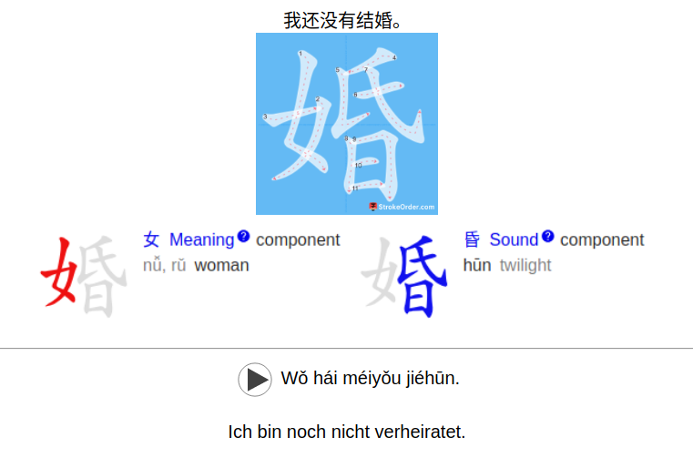

This is a simple Anki addon to help learning Chinese characters by showing you stroke orders and components.

# Demo
E.g. here the stroke orders and component information generated if you click on the character "婚" (hūn, translating to "wedding"):
<p align="center">
  
</p>

# Usage
1. cd into the addon directory (e.g. `cd /home/username/.local/share/Anki2/addons21/ankistuff`)
2. Re(start) Anki
3. Add the fields "Chinese character" and "Characters with strokes" as fields to your note
4. Select some notes in the note browser and then under "Edit" press "Process Chinese Characters". This will add the stroke order and component information to the selected notes under the field "Characters with strokes".
5. Change the back template of your card to 
```
{{Characters with strokes}}

<hr id=answer>

{{Pronunciation}} {{Pinyin}} <br><br>
{{Translation}} 

<script>
            function showImage(charId) {
                var clickedContainer = document.getElementById(charId);
                var clickedImages = clickedContainer.getElementsByTagName('img');
                var isCurrentlyShown = clickedImages[0].style.display === 'block';
                
                // Hide all images in all containers
                var allContainers = document.getElementsByClassName('image-container');
                for (var cont of allContainers) {
                    var imgs = cont.getElementsByTagName('img');
                    for (var img of imgs) {
                        img.style.display = 'none';
                    }
                }
                
                // If the clicked images weren't showing before, show them now
                if (!isCurrentlyShown) {
                    for (var img of clickedImages) {
                        img.style.display = 'block';
                    }
                }
            }
            </script>
```